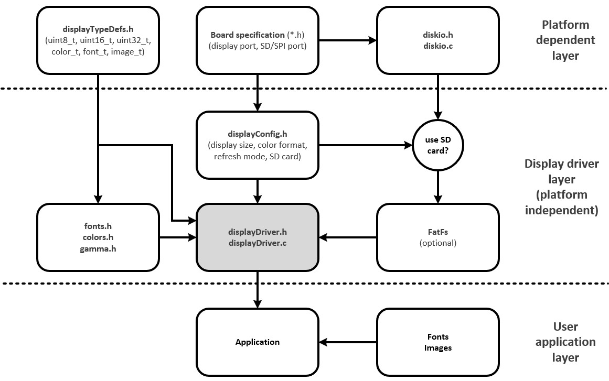

# LED Matrix Display Driver Library

## About Library (REV_DATE 230519)

This is library source code to work with LED Matrix Displays. Library is both functionaly and platform configurable. Current version supports following:

- Board (platform) selection. Included boards:
   - [MINI-32 for PIC32MX](https://www.mikroe.com/mini-pic32mx) 
   - [MINI-32 for PIC32MZ](https://www.mikroe.com/mini-32-for-pic32mz)
   - [MINI-M4 for STM32](https://www.mikroe.com/mini-stm32f4)
- Color format selection. Supported:   
   - RGB111 (native)
   - RGB332
   - RGB565
   - RGB888
- Individual LED panel configuration (size, number of selection bits, number of subpanels)
- Display size configuration (depending on the number and type of LED panels used)
- SD Card support based on [ChaN's FatFS](http://elm-chan.org/fsw/ff/00index_e.html). 
- Operational (refresh) mode configuration. Supported:
   - Manually - use refreshDisplay function, displayDelay executes refreshDisplay
   - Timer - refresh triggered by timer, requires timer interrupt implementation to execute function refreshDisplay() 
   - FreeRTOS - refresh executed in separate FREERTOS task, requires separate task implementation for refreshDisplay() execution

More info on [OptoLAB](http://www.optolab.ftn.uns.ac.rs/index.php/education/project-base/242-led-matrix-display-library-examples)

Preconfigure and precompiled examples:
   - [MINI-32 for PIC32MX](https://github.com/OptoLAB/LED-Matrix-Display-Driver-PIC32MX) 
   - [MINI-32 for PIC32MZ](https://github.com/OptoLAB/LED-Matrix-Display-Driver-PIC32MZ)
   - [MINI-M4 for STM32](https://github.com/OptoLAB/LED-Matrix-Display-Driver-STM32)

Demo video on [youtube](https://www.youtube.com/watch?v=5Obz87ZCj9I)

## Library organization (REV_DATE 230519)

